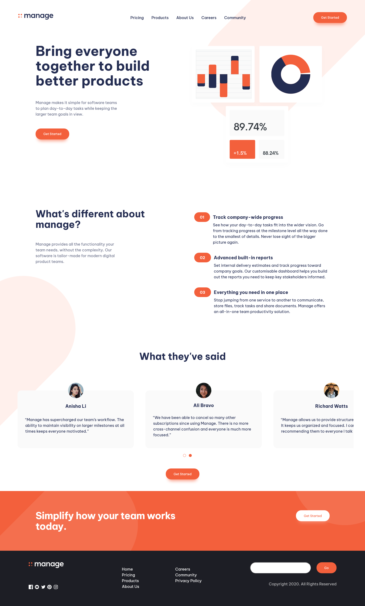

# Manage-landing-page

## Table of contents

- [Overview](#overview)
  - [Screenshot](#screenshot)
  - [Links](#links)
- [My process](#my-process)
  - [Built with](#built-with)
  - [What I learned](#what-i-learned)
- [Author](#author)

## Overview

### Screenshot

### Links

- [Solution URL](https://github.com/adriananin/manage-landing-page)
- [Live Site URL](https://adriananin.github.io/manage-landing-page/)

## My process

### Built with

- HTML
- CSS
- JS
- Vite
- Allyslider

### What I learned

- How to create accessible sliders.
- How to create Hamburger menus.

## Author

- Website - [Adrian Anin](https://adriananin.github.io/anin-blog-odyssey/)
- Frontend Mentor - [@@adriananin](https://www.frontendmentor.io/profile/adriananin)
